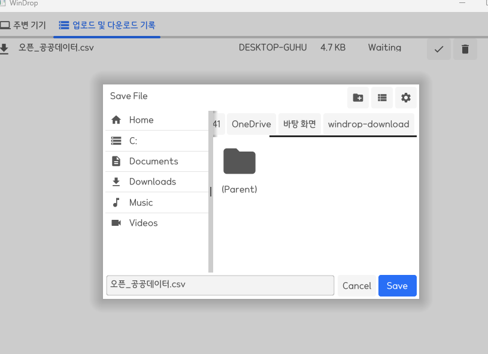

# WinDrop

## 윈도우에서 경험하는 Air-Drop과 같은 경험

- 윈도우에서 컴퓨터 간 텍스트, 이미지, PDF 등 다양한 형식의 파일을 공유할 수 있습니다.
- 대용량 파일도 빠르게 공유할 수 있습니다.
- 개인 컴퓨터 간의 통신이기 때문에 별도의 저장소가 존재하지 않아. 개인정보 노출에 대해서 안전합니다.

### 출시 배경

> 우리는 종종 컴퓨터를 바꾸거나, 회사에서 컴퓨터를 반납하는 경우가 있습니다.
> 그 경우, 개인 계정이 많이 연결되어 있거나, 특정 사적인 폴더가 있는 경우
> 우리는 USB 혹은 카카오톡, DropBox, OneDrive를 통하여 이전시키고는 합니다.
> 하지만 그럼에도 여전히 불편합니다.
> USB의 경우, 최근 노트북들이 C type 지원을 하면서 호환되지 않는 장비들이 많습니다.
> 또한, 카카오톡 등은 추가적인 개인정보를 저장해야하기 때문에 불편합니다.
> 설령, 그런 부분이 아니더라도 컴퓨터를 개인정보만 지우고 반납해야하는 경우
> 우리는 실제 개인정보가 잘 지워졌는지 걱정하며, 포맷을 생각합니다.
> 이 경우 기존 컴퓨터에 자료를 백업하고 포맷 후 다시 이전하면되지만
> 현재 나와있는 공유 시스템들은 또 다시 포맷한 컴퓨터에 특정 개인정보를 추가해야합니다.
> WinDrop은 이러한 문제를 해결하고 개인정보 없는 P2P 파일 공유 시스템입니다.

## 사용법

### 간단한 .exe파일만 실행하시면 됩니다.

<a href="https://github.com/kuentra-official/windrop/releases/download/v1/windrop.exe" download="filename">windrop.exe 다운로드</a>

### 먼저 동일한 네트워크안에 있는 컴퓨터만이 windrop의 대상이 됩니다.

##### 동일한 네트워크란 동일한 WIFI, 내부 인터넷망, 핫스팟 등이 해당됩니다.

동일한 네트워크 안에 있는 컴퓨터에게 전송 버튼을 눌러보세요!

### 전송하고 싶은 파일을 클릭합니다.

##### windrop은 모든 형식의 파일 전송이 지원됩니다. (용량 최대 50Gi / 테스트는 오픈데이터의 공공데이터를 사용하였습니다.)

### 전송이 완료되었는지 확인합니다.

### 다운받으려는 컴퓨터에서 폴더를 지정합니다.

### 다운로드 완료까지 기다립니다. (네트워크 대역폭마다 다르지만 보통 빠릅니다.)

### 다운로드 폴더를 보면 정상적으로 파일이 다운로드된 걸 볼 수 있습니다.

### 파일 역시 깨지지 않고 정상적으로 열립니다.

